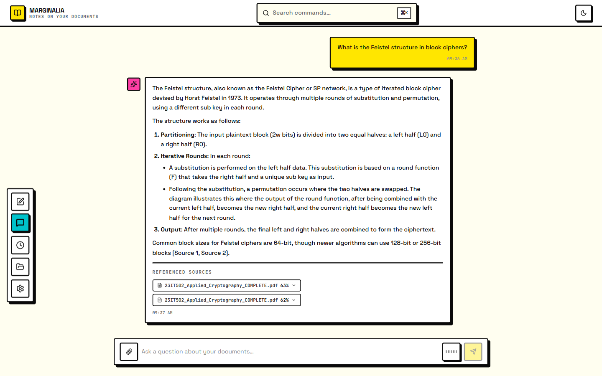
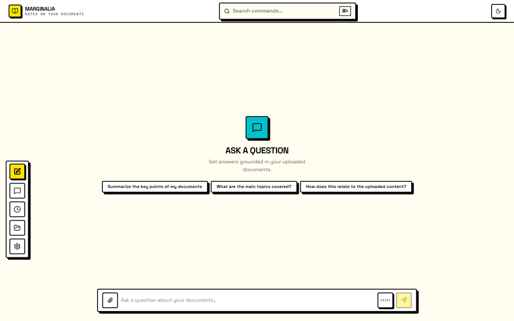
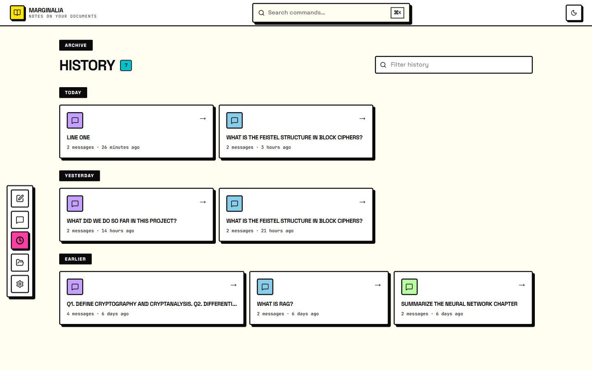
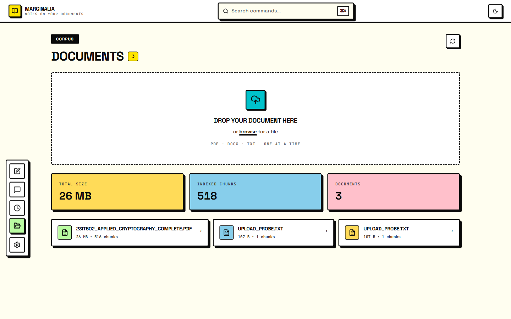
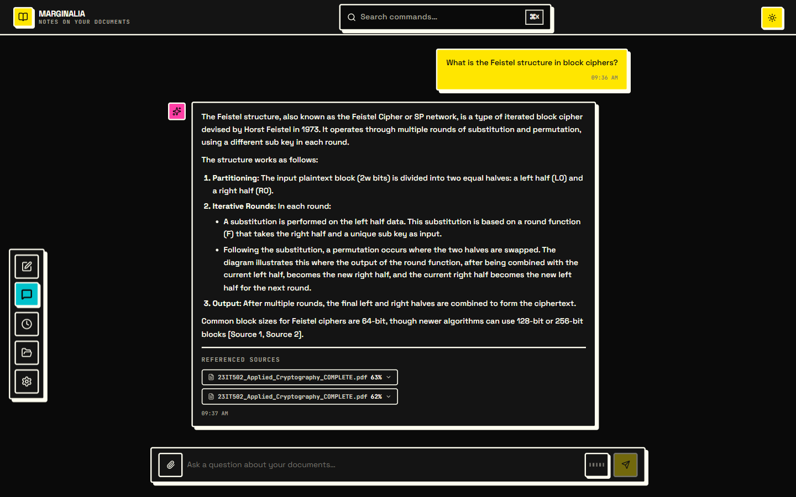

<div align="center">

# Marginalia

**Answers from your documents — grounded, cited, and linkable.**

[](https://github.com/prakashseervi61/QA-Assistant/actions/workflows/ci.yml)
[](https://www.python.org/)
[](https://react.dev/)
[](https://fastapi.tiangolo.com/)



</div>

---

## Why

Most chat with your documents either invents answers or makes you dig for
where they came from. Marginalia does the opposite: every claim is assembled
from chunks of *your* files, each one cited and expandable, with a confidence
score so a shaky answer looks shaky.

It runs entirely on your machine. The only network call is to the LLM.

## Screens

<table>
<tr>
<td width="50%"></td>
<td width="50%"></td>
</tr>
<tr>
<td></td>
<td></td>
</tr>
</table>

## What you get

- **Every chat is a URL** — `/chat/<id>`. Linkable, refresh-safe, and back
  button steps between conversations.
- **Live retrieval trace** — watch *guardrails → retrieving → reranking →
  generating* stream in as the answer is built.
- **Local embeddings** — `all-MiniLM-L6-v2` runs on your CPU. No embedding API
  key, no document text leaving the machine, no per-token cost.
- **Better retrieval by default** — semantic chunking plus BGE cross-encoder
  reranking, both on without configuration.
- **Deduplicating uploads** — a byte-identical file is caught by SHA-256 and
  skipped instead of re-embedded.
- **Guardrails included** — PII and prompt-injection checks on input,
  groundedness and PII-leak checks on output.

## Run it

Requires **Python 3.10+**, **Node 18+**, and a
[Gemini API key](https://aistudio.google.com) (free tier available).

```bash
git clone https://github.com/prakashseervi61/QA-Assistant.git
cd QA-Assistant

python -m venv .venv && source .venv/bin/activate   # Windows: .venv\Scripts\activate
pip install -e ".[dev]"

(cd src/presentation/react && npm install)

cp .env.example .env        # Windows: copy .env.example .env
# then set GEMINI_API_KEY in .env

scripts/start_all.sh        # Windows: scripts\start_all.bat
```

Open **http://localhost:3000**. That's the whole setup — Vite proxies `/api/*`
to the API on port 8000, so there's nothing else to wire up.

Prefer Docker? `docker compose up --build`.

## Stack

| | |
| --- | --- |
| **Frontend** | React 18 · Vite · Tailwind · framer-motion |
| **API** | FastAPI · Uvicorn · Pydantic v2 |
| **Retrieval** | ChromaDB · BGE cross-encoder reranking |
| **Generation** | Gemini (`google-genai`) |
| **Embeddings** | sentence-transformers, local |
| **Parsing** | PyMuPDF → PyPDF2 fallback · python-docx |
| **History** | SQLite |

## Configuration

One variable matters: `GEMINI_API_KEY`. Everything else has a working default —
and you can paste a key in **Settings → API key** instead of editing `.env`,
which takes effect on your next question without a restart.

| Variable | Default | |
| --- | --- | --- |
| `GEMINI_API_KEY` | — | **Required**, unless set in Settings |
| `GEMINI_MODEL` | `gemini-2.5-flash` | |
| `ENABLE_RERANKING` | `true` | Cross-encoder re-scoring |
| `ENABLE_SEMANTIC_CHUNKING` | `true` | Split on meaning, not fixed windows |
| `ENABLE_HYBRID_SEARCH` | `false` | Add BM25 keyword search |
| `ENABLE_INCREMENTAL_INGESTION` | `false` | Skip byte-identical re-uploads |
| `ENABLE_GUARDRAILS` | `true` | PII / injection / groundedness checks |
| `GUARDRAIL_BLOCK_VIOLATIONS` | `false` | Flag-only unless set `true` |

Full list with descriptions: [`.env.example`](.env.example).

## API

Everything lives under `/api`, bound to loopback only — that boundary is the
access control, so there's no auth layer. Interactive docs at
**http://localhost:8000/docs**.

| | Endpoint | |
| --- | --- | --- |
| `GET` | `/api/health` | Liveness + vector-store status |
| `POST` | `/api/documents/upload` | Ingest a document |
| `GET` | `/api/documents` | List documents |
| `DELETE` | `/api/documents/{id}` | Delete a document |
| `POST` | `/api/query` | Ask a question |
| `POST` | `/api/query/stream` | Ask a question, streamed over SSE |
| `GET` | `/api/conversations` | List conversations |
| `GET` | `/api/conversations/{id}` | Read a conversation |
| `DELETE` | `/api/conversations/{id}` | Delete a conversation |
| `GET` | `/api/usage` | Token usage and cost |
| `GET` | `/api/settings` | Non-secret runtime configuration |
| `GET`/`PUT`/`DELETE` | `/api/settings/api-key` | Read, set, or clear your Gemini key |
| `GET` | `/api/export` | Every document and conversation as JSON |

## Development

```bash
python -m pytest -q                      # 325 tests
python -m ruff check src/ tests/ eval/   # lint
python -m ruff format src/ tests/ eval/  # format

(cd src/presentation/react && npm test && npm run build)
```

CI runs lint, the suite on Python 3.10/3.11/3.12, the frontend tests and build,
and both Docker images on every push.

RAG quality is measurable rather than a matter of opinion — `eval/` scores the
pipeline with [RAGAS](https://docs.ragas.io/) against a golden set and exits
non-zero when a metric regresses:

```bash
python eval/ragas_eval.py --sample 3
```

Run it before and after touching the pipeline.

## Layout

```
src/domain/            entities + ports (no inward imports)
src/application/       use cases, RAGEngine, DTOs
src/infrastructure/    adapters: llm, embeddings, parsers, store, guardrails
src/presentation/     FastAPI routes · React app
eval/                  RAGAS harness + golden dataset
```

## Troubleshooting

**`429 quota exceeded`** — the AI Studio project behind your key has no billing
account, so the free tier reports `limit: 0`. Linking billing at
<aistudio.google.com> is free. The app degrades cleanly meanwhile: `/api/query`
returns a readable `429`, and the streaming endpoint returns `200` plus an
`error` event, so clients never see a truncated stream.

**First query is slow** — `all-MiniLM-L6-v2` (~90 MB) downloads from HuggingFace
on first use, then runs offline from cache.

**Blank page** — check `curl localhost:8000/api/health`. A missing API key
surfaces as a query-time error, not a startup failure.

---

<div align="center">
  <sub>Built with FastAPI, React, and an unhealthy amount of bold borders.</sub>
</div>
