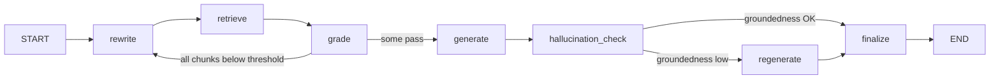

# LangGraph Agentic RAG — Design Proposal

> **Status: Design proposal — not implemented.**
> Exploratory design document only. No code, no settings changes, no tests, no commits.
> Created: 2026-08-10 · Repo: QA-Assistant · Branch: main · HEAD: `b0fb457`

---

## 1. Problem Statement

**Capability gap.** `RAGEngine.query()` / `query_stream()` execute a fixed, linear pipeline: embed → retrieve → (parent-child expand) → (rerank) → build prompt → generate. The pipeline cannot *adapt at runtime*:

- retrieved chunks are never **graded** for relevance before entering the prompt — irrelevant context is passed straight through;
- there is no **retry loop** — a question that retrieves poorly gets one chance (`NO_RELEVANT_CONTEXT_MESSAGE` or a weak answer);
- there is no **post-generation recovery** — when the groundedness check fails (output guardrail, `_check_output`), the answer is flagged but never regenerated.

The result: vague or poorly-retrieved questions can yield confident but ungrounded answers, and the system never self-corrects.

**Value vs. effort.** The roadmap (Task 5.3, Phase 5 "Advanced & Scale (Week 6+)") labels LangGraph Agentic RAG **LOW IMPACT**, and the label is largely earned here: the *control loop* is the only net-new capability. Five of the six loop ingredients already exist in this codebase as opt-in flags — query rewriting (`QueryRewriter` + RRF in `rag_engine.py`), hybrid search, parent-child expansion, reranking, and post-generation groundedness checks (`GuardrailManager.check_output`). What is missing is orchestration: grade-then-retry and check-then-regenerate. That narrow slice of value must be weighed against a new orchestration dependency (`langgraph` + transitive `langchain-core`) and a second engine to maintain.

---

## 2. Proposed Architecture

### Components

| Layer | New / Changed | Responsibility |
|---|---|---|
| **Domain** | NEW `src/domain/value_objects/agentic_state.py` — the state schema (section 3). No new provider interfaces: reuses `LLMProvider`, `EmbeddingProvider`, `VectorStore`, `QueryRewriter`, `Reranker` | Contracts only |
| **Application** | NEW `src/application/services/agentic_rag_service.py` — `agentic_query()` and `agentic_query_stream()` exposing the **exact same response contract** as `RAGEngine` (answer / sources / confidence / metadata; stream yields token chunks + `{"type": "done", ...}` event) so `src/presentation/api/routes/chat.py` and the frontend `ChatWidget.jsx` are unchanged | Orchestration, feature-gating |
| **Infrastructure** | NEW `src/infrastructure/agentic/` — `graph.py` (LangGraph `StateGraph`), `nodes.py` (thin wrappers over existing building blocks), `agentic_factory.py` (mirrors `LLMProviderFactory`). MODIFIED `src/application/services/rag_engine.py` — extract shared retrieval helpers (RRF fuse, parent-child expansion, empty-retrieval responses) into a shared module for reuse; **behavior unchanged** | Framework isolation, wiring |

### Node / edge graph

- **rewrite** — reuse `QueryRewriter` (from `src/infrastructure/llm/query_rewriter_factory.py`) + existing `_rrf_fuse` helper; skipped on iteration 0 unless the user question is short/vague (deterministic rule).
- **retrieve** — reuse the existing embed → similarity/hybrid → parent-child expand → rerank path verbatim.
- **grade** — per-chunk relevance judge via `LLMProvider.generate_json()`; drops chunks below `AGENTIC_GRADE_THRESHOLD`.
- **rewrite loop** — conditional edge back to rewrite when nothing passes grading, capped at `AGENTIC_MAX_ITERATIONS`.
- **generate** — streaming via `llm.generate_stream()` (buffered for the check, streamed to the caller with the existing event contract).
- **hallucination_check** — reuse `GuardrailManager.check_output()` (same groundedness logic `rag_engine.py` already calls via `_check_output`).
- **regenerate** — single retry with narrowed context (keep only the highest-graded chunks) when the check fails; `AGENTIC_MAX_REGENERATIONS=1`.

### Data flow & Clean Architecture fit

Question → (rewrite) → retrieve → grade → generate → check → finalize, with metadata carrying `{"agentic": {...}}` (iterations, grades, guardrails, `prompt_version` — the same metadata-merge pattern `RAGEngine._finalize` uses today). LangGraph is pure orchestration detail confined to `src/infrastructure/agentic/`; the application service and API see only the two query methods. The engine is selected additively: `src/application/use_cases/query_document.py` (and `chat.py`) route to `AgenticRAGService` only when `ENABLE_AGENTIC_RAG` is true; otherwise the existing `RAGEngine` path is byte-identical. This matches the established `ENABLE_*` flag convention in `settings.py`.

---

## 3. Data Model Changes

### State schema (per-query, in-memory — no persistence)

`AgenticRAGState` (TypedDict in `src/domain/value_objects/agentic_state.py`):

| Field | Type | Notes |
|---|---|---|
| `question` | `str` | User question (guardrail-checked before the graph starts) |
| `rewritten_queries` | `list[str]` | Output of rewrite node (0..N variants) |
| `retrieved_chunks` | `list[Chunk]` | Reuses the existing `Chunk` value object |
| `grades` | `dict[str, float]` | `chunk_id → relevance score` from the grade node |
| `context_chunks` | `list[Chunk]` | Post-grade, prompt-ready chunks |
| `answer` | `str` | Current generation |
| `groundedness` | `float \| None` | From the hallucination-check node |
| `iterations` | `int` | Strictly monotonic; bounds the rewrite loop |
| `regenerations` | `int` | Bounds the regenerate node |
| `events` | `list[str]` | Trace breadcrumbs (node names + outcomes) |
| `final` | `dict` | The existing result shape: `answer`, `sources`, `confidence`, `metadata` |

### Edges & constants

- Edges: `rewrite→retrieve`, `retrieve→grade`, `grade→(pass)→generate`, `grade→(fail & iters<N)→rewrite`, `generate→hallucination_check`, `hallucination_check→(ok)→finalize`, `hallucination_check→(fail)→regenerate`, `regenerate→finalize`.
- Constants: `AGENTIC_MAX_ITERATIONS=2`, `AGENTIC_MAX_REGENERATIONS=1`.
- No storage schema changes: state is ephemeral; conversation-history injection is deferred to Phase 3.

---

## 4. Integration Points

### Modules that would change (when the feature is built)

- `src/infrastructure/config/settings.py` — new flags (below)
- `src/domain/value_objects/agentic_state.py` — **new**
- `src/infrastructure/agentic/` (`graph.py`, `nodes.py`, `agentic_factory.py`) — **new**
- `src/application/services/agentic_rag_service.py` — **new**
- `src/application/services/rag_engine.py` — extract shared retrieval helpers (RRF fuse, parent-child expansion, empty-response builders) into a shared module; **no behavioral change**
- `src/application/use_cases/query_document.py` and `src/presentation/api/routes/chat.py` — engine selection when the flag is on
- `pyproject.toml` — new optional-dependency extra

### New settings (all default OFF / empty)

| Setting | Default | Purpose |
|---|---|---|
| `ENABLE_AGENTIC_RAG` | `False` | Master gate; routes to the agentic engine |
| `AGENTIC_MAX_ITERATIONS` | `2` | Rewrite-loop cap (bounds latency and cost) |
| `AGENTIC_GRADE_THRESHOLD` | `0.6` | Minimum per-chunk relevance to enter the prompt |
| `AGENTIC_MAX_REGENERATIONS` | `1` | Post-check regeneration cap |

The groundedness threshold is **reused** from `GUARDRAIL_GROUNDEDNESS_THRESHOLD` (default `0.2`) — no duplicate knob.

### New optional dependencies + why

- `langgraph>=0.2.0` — state-graph runtime with async support (`astream`). New extra: `agentic = ["langgraph>=0.2.0"]`.
- Note: `langchain-core` arrives transitively; this is a flagged dependency-weight risk (section 5).
- **Fallback if the dependency is vetoed:** the same node/edge graph implemented as a pure-`asyncio` loop — zero new deps. Documented as the alternative in the design review.

---

## 5. Risks & Mitigations

Aligned with the roadmap risk table (lines 980–988).

| Risk | Mitigation |
|---|---|
| **Dependency weight** — `langgraph` + transitive `langchain-core` add a sizable package tree | Optional extra only; lazy imports in `agentic_factory.py` (cf. `LLMProviderFactory`'s lazy imports); CI runs without the extra; same policy as the roadmap's "Marker heavy dependencies → make optional" |
| **Latency** — grade adds 1 LLM round trip; rewrite loop adds up to `AGENTIC_MAX_ITERATIONS` more | Grade only when `len(chunks) > 1`; hard caps on iterations/regenerations; per-node spans via existing `ENABLE_TRACING` (cf. roadmap "Phoenix adds latency → sample 10% in prod") |
| **Cost** — judge + rewrite calls multiply token spend | Iteration caps; skip rewrite on iteration 0 unless question is short/vague; propagate `LLMQuotaExceededError` so 429 behavior is identical to today; visibility via existing `token_tracker` |
| **Maintainability** — a second engine to keep in sync with `RAGEngine` | Extract shared retrieval helpers once; agentic nodes stay thin wrappers; single prompt source (`prompt_registry.py`); both engines covered by the same quality gates |
| **Streaming compatibility** — LangGraph token streaming differs from the hand-rolled generator in `query_stream()` | `agentic_query_stream()` buffers node output internally and yields the **exact existing event contract** (text chunks + `done` event with guardrails/prompt_version); `ChatWidget.jsx` unchanged |
| **Behavioral risk** — retry loops can oscillate or repeat failed retrievals | Strictly monotonic `iterations`; deterministic rewrite; grade threshold configurable; outcome counters surfaced in `events` for evaluation |

---

## 6. Decision Recommendation

**Defer** (validate the loop without LangGraph first; adopt only on evidence or product need).

1. The roadmap rates this **LOW IMPACT** (Phase 5), and Phase 2 features (query rewriting, parent-child) already deliver the primary recall gains this loop would amplify.
2. Five of the six loop capabilities already exist as flags in this codebase; the net-new value is only the grade-and-retry / check-and-regenerate control loop.
3. That loop's value is unproven for the current corpus — it should be validated cheaply as a pure-`asyncio` experiment (no new dependency) before committing to `langgraph`.
4. Full adoption adds a heavyweight dependency plus a second engine to maintain, increasing code-review, QA, and evaluation burden for a marginal, unquantified gain.
5. Concrete revisit triggers: (a) `eval/` RAGAS shows a measurable ungrounded-answer or retrieval-failure rate on the current corpus; (b) product adopts multi-turn or tool-using agentic behavior — at that point LangGraph is the right vehicle and this design's state schema and node graph are ready to lift.

---

## 7. Phased Rollout Sketch (if adopted)

**Phase 1 — Validate without LangGraph.** Extract shared retrieval helpers from `rag_engine.py` (no behavior change). Implement the grade node + rewrite loop as a standalone service behind `ENABLE_AGENTIC_RAG` using plain `asyncio`. RAGAS eval (`eval/`) compares baseline `RAGEngine` vs. the loop on the existing golden set. **GO/NO-GO gate on evidence** before any dependency is added.

**Phase 2 — Formalize with LangGraph.** Introduce the `StateGraph` around the validated nodes; `agentic_factory.py` wiring; engine selection in `query_document.py` / `chat.py`; streaming compatibility verified against the existing event contract; unit + integration tests.

**Phase 3 — Extend.** Conversation-aware state (history from `ConversationRepository` / `src/infrastructure/repositories/`), per-node tracing spans, A/B routing vs. the linear engine (reuse the deterministic bucketing pattern from `ENABLE_PROMPT_AB_TESTING`), documentation.
